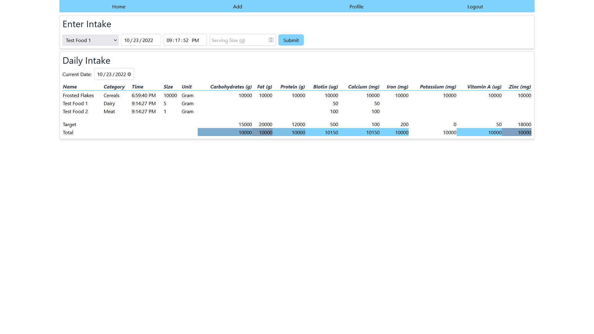
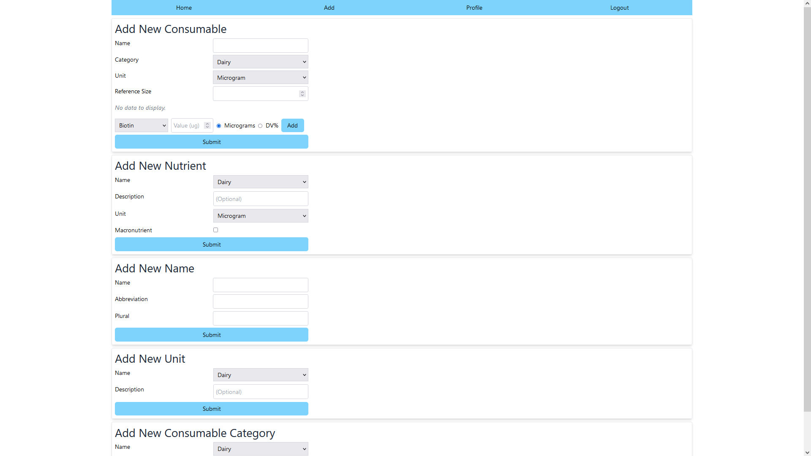
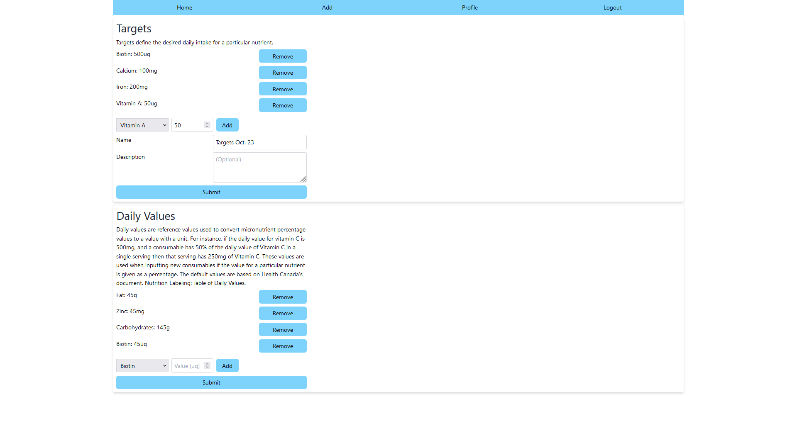

<h1>The Project</h1>

The Nutritioner 6000 (patent pending) is an improvement of the original [Nutrition Tracker](https://github.com/kens-git/nutrition_tracker/) program that is used to track and display a user's daily nutritional intake. It's comprised of a React front-end (this repo), and a [Django back-end](https://github.com/kens-git/nutritioner_6000_back_end), and will be (as of October 23rd, 2022) hosted on Debian using Nginx, Gunicorn, and Postgres.

The app's design and back end API were designed under the assumption that an instance of it would be shared with a small number of users, which influenced the design of the models (mainly controlling what data a user can delete) and UI components, where it's expected that data will reasonably fit into dropdown components and tables without limiting the displayed data.

The app primarily serves as a personal introduction into full stack web development beyond trivial todo apps, and is meant to provide a basis of comparison when developing future projects as well as when exploring projects and ideas from other developers. Overall, the app does what it's expected to do, but, there's is still a lot of room for improvement.

  
Home Page Preview

  

  
Add Page Preview

  

  
Profile Page Preview

  

<h1>Improvements Since the Original Nutrition Tracker</h1>

  
Improved Data Flexibility

  
There's 33 common macronutrient (e.g., fat, protein) and micronutrient (e.g., vitamin A, zinc) types, and the previous version had to refer to every one of these nutrients wherever nutrients were used, even if some of them weren't used.

  
Another issue is that the database table had a fixed column for each nutrient, meaning that if a nutrient needed to be added the table would need to be modified.

  
Lastly, if a nutrient was added the UI would need to be updated to add an input, table column, and other display components to properly support the new nutrient.

  
Nutritioner 6000 handles these issues by treating a consumable as having a dynamic amount of nutrients in the database and in the UI, meaning users can enter custom nutrient types without requiring any modifications to the implementation. This also simplifies the implementation by allowing nutrients to be treated generically as a list.

 

  
Targets Displayed with Daily Intake

  
Instead of comparing targets to intakes ambiguously through a progress bar, the target nutrient values are displayed as a row in the intake table. Additionally, a color gradient is displayed in the 'totals' row to show at a glance how the daily intake for a nutrient compares to the target value.

 

As a consequence of being a web app, the software is available anywhere there's a browser. Or cURL, if that's your thing.

Authentication, allowing multiple users.

Users can enter custom units, categories, and nutrients.

Users can define their own daily values.

 
<h1>Remaining TODOs</h1>
<ul>
  <li>JWT tokens either don't expire, or have too long of a lifetime. For this app, they would ideally expire after the session.</li>
  <li>The server returns status code 500 when a duplicate value is submitted for Django model fields that should be unique.</li>
  <li>The functionality exists on the back end to update certain data, but for brevity they were left out on the front end.</li>
  <li>For usability, the data displayed in the Select component should be sorted (plus other UX improvements described below).</li>
  <li>The screenshots in this document are displaying cartoonish test values that should be replaced with more realistic values.</li>
</ul>

<h1>Pre-Post-Mortem and Next Steps</h1>

The project was built using Django, Django Rest Framework and React but I intentionally kept other external dependencies and 3rd party code to a minimum so I would be exposed to the types of problems that they attempt to solve, and what problems they abstract. I believe if I just pulled in a ton of dependencies and called it a day I wouldn't really understand the role they play beyond a superficial level.

Overall, maintainability is a primary goal on any project and for a basic CRUD app this one does the job in a simple and straightforward way, but may suffer from fragility if dependencies between data were introduced, because the DataContext was designed to work independently from the other instances of it, aside from the AuthContext.

Specific things I will consider when working on my next project are:
</li>

  
Data Handling and Typing

  
The main thoughts I had when starting this project were that I wanted to centralize data handling between the application and server so that individual components wouldn't be dealing with requests, and I wanted to have components deal with specific types instead of passing JSON (or other untyped objects) around. React contexts, Typescript, and Axios make both ideas possible and overall I'm okay with how this turned out.

  
Since there's no dependencies between the data when loading, having a context for each data type (e.g., Nutrient, Intake, etc.) worked to provide the typing I was after, and since each type represented a basic 'CRUD type' on the back end I was able to implement a higher-order function to create a Provider for each context in a generic way, which shortened the implementation.

  
Some things I would consider when dealing with requests/responses in the future are:

  <ul>
    <li>
      <h3>Handling potential race conditions.</h3>
      
A login is required to access the back end, and it's possible that the login hasn't completed before the requests for the data are sent. This would likely be a simple fix in this project, but it highlights the need in the future to consider dependencies in data and data loading.

    </li>
    <li>
      <h3>Mutability of context data.</h3>
      
The DataContext data is accessible as an object property so anything using it can mutate the data. I attempted to implement DataContextData as a class but because data is used in an effect hook in DataContext, it needs to be exposed to trigger updates.

    </li>
    <li>
      <h3>Syncing.</h3>
      
Shared data (e.g., consumables, units) is loaded when the user starts a session and the local cache doesn't sync with the database after that (in cases where a second user adds shared data). The expectation is that shared data will mostly be added at the beginning of the app's lifetime, and the small number of users mean inconsistencies caused by the cache being out of sync will keep issues to a minimum, if they're ever observed at all. Ultimately, this syncing issue won't cause app-breaking issues so for brevity it wasn't addressed.

    </li>
  <ul>

  
Error Handling

  
Error handling and formatting will need to be considered, especially in how to turn cryptic or generic error responses into something useful to the user.

  
Since a failure in the app can be noticed by either a form error or a lack of updates in the UI, error messages weren't critical in the functioning of the app.

  
React Best Practices

  
Being from a desktop background I had to get used to React's way of handling data, state, and so on. I originally created some model classes for handling data and state but found it ran completely counter to how React was meant to work. On desktop I would define models and how they interact with each other completely independent of the view, so it was challenging to make the mental switch between defining models and React's unidirectional data flow that is intertwined with components. I'm sure there's a lot of improvements that could be made to the components in terms of separation of concerns, and how that would function in the context of React.

  
Related to the last point, having a better grasp of React best practices and overall architecture should optimize the number of renders. Ideally, there's a specific cause-effect relationship between state updates and renders, where a single state update should only cause a single render in the affected components. There's a number of cases in the components where a state updates causes multiple re-renders of the same components.

  
Typescript Best Practices

  
Since I was learning Typescript as the project was developed, certain code styling was inconsistently applied: mostly related to where to apply line breaks, naming conventions (I switched from snake-case to camel-case over the course of the project), import order, and so on.

  
The next project will need a defined coding style and linter applied from the beginning.

  
UI/UX improvements

  
The UI leaves a lot to be desired in terms of overall styling and is probably the weakest part of the app, so existing components and styles would improve the look greatly. I went with Tailwind CSS because its utility-first implementation allowed me to drop classes into components and have a relatively consistent style without writing custom CSS, which should be left to people with more courage than myself.

  
The layout is functional on all platforms, but could benefit from a mobile design and more breakpoints.

  
Theming support would be nice.

  
On the UX side, some success messages when certain actions are completed would make the experience less ambiguous, and a filtered dropdown for selecting names, units, etc., would improve the usability.

  
Generic Forms

  
Most forms in the app follow a similar structure and could probably be constructed and handled based on a generic implementation.

  
Date/Time Handling

  
Date and time handling is mixed throughout the app with hardcoded formats. There should be a way to negotiate or retrieve the expected format from the server and apply a consistent format everywhere.

  
Localization and Accessibility

  
It's unlikely I would ever add localization to a project I personally use, but for completeness localization support should be added with a way to extract displayed strings from UIs and instead query the displayed strings in the appropriate locale as needed.

  
Like localization, without a need for it I wouldn't put a huge focus on accessibility unless there was a need to. This hampered testing, however, because certain accessibility cues are expected to exist in order to retrieve elements from the test container in the React Testing Library. I could probably find a different testing library but in the future I would address accessibility from the start as it's a better practice, anyway.

  
The create-react-app tool provides some form of default PWA support that I removed because I didn't need it for this project, but in general it would be nice to have.

  
Testing

  
Testing would need to be greatly expanded, and in this project there's not much - if anything - that wouldn't benefit from having tests so full test coverage would be ideal. As mentioned above the lack of accessibility made testing difficult and I was okay with manual testing for verification on a project I've done before, so tests were done mainly to gain some experience with them and to see some of the challenges specific to testing a web UI.

  
I didn't use TDD when working on desktop app because it was simpler to test classes and functions as a result of the simpler interfaces (in terms of controlling access) they present. It may be worth exploring TDD for components because simplicity of testing may influence a better component design.

  
The few tests I did were basic unit tests to assert a component was displaying what was expected, but testing should be expanded to include other types of tests (e.g., integration), and at different levels of granularity.

  
Tooling and Project Setup

  
I overlooked just how beneficial a proper development setup would be. I had VS Code set up for developing and debugging Python and Django, and Typescript and React, but there was a number of times where I struggled to pinpoint where an issue occurred and what the state of the app was at a particular moment. I leaned on console logging a lot, but there must be much better tooling available to pinpoint and fix various issues. The only external tool I used aside from the browser was Postman, for testing how the API functioned and what formats it gave and expected.

  
As mentioned above, the project would benefit from a standardized coding style and a linter.

  
I was sometimes at a loss for where to put certain files, so standardizing the project directory structure would benefit maintenance.

